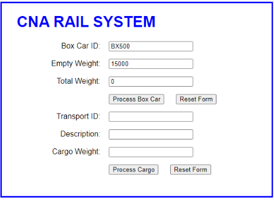
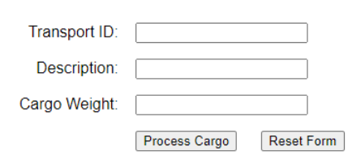
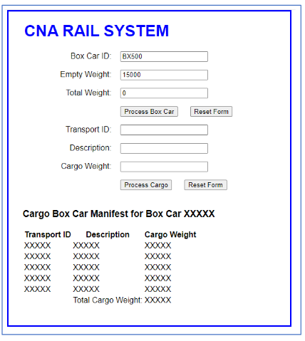

# CP1295 Advanced JavaScript – Assignment 01 – 3% 

## Contents
[A. Brief Description]( #a-brief-description)

[B. Initial Page](#b-initial-page)

[C. Box Car Form](#c-box-car-form)

[D. Cargo Processing Form](#d-cargo-processing-form)

[E. Process_Cargo JavaScript](#e-process_cargo-javascript)

[F. Submission Reqirements](#f-submission-reqirements)

[G. Code Requirements](#g-code-requirements)

[H. Grading Rubric](#h-grading-rubric)
 
___

## A. Brief Description 
 
- Assignment for the course are threaded.  
- First Assignment begins the thread. 
- Each subsequent component adds onto the previous assignment. 
- Since this is a first run for this assignment thread, there is no solution yet established. 
 
 
- I have created the specifications of the first assignment that should provide a solid thread path through all 10 assignments. As the assignments are assigned, it is hopefull that most of the code from the 
previous assignment will form much of the code for the next assignment.  
The goal is to spend less time explaining the model and more time working on the solution. 
 
- The model for the assignments involves managing cargo for a rail system. 
In Assignment 01 we will require a single web page form that will contain  
    1. data regarding a Box Car that will eventually be attached to a train. 
    2. data regarding new Cargo Items that will be shipped.  
    3. Output Display showing all of the cargo that is in the Box Car. 
 
  
## B. Initial Page


 
Initial Page will contain only two forms. 
1. Box Car form with three text fields and labels as shown here. 
    - Box Car form has non-functional buttons

2. Process Cargo Form with three text fields and labels as shown here.
    - Process Cargo Form’s has two functional buttons
 

The index.html should only contain code for what is shown in the initial form.

  

## C. Box Car Form 
 
CNA Rail System has only ONE box car. 
These are the details for  the box car form of the page. 
There are three fields on this form 
- all fields are set to read only 
- set initial values for each text field as indicated in the json below
```json
"initial values":[
    {"Box Car ID" : "BX500"},
    {"Empty Weight" : 15000},
    {"Total Weight" : 0}
]
```
 
 
The two buttons are non functional for this assignment.  
The empty weight signifies the empty weight of the Box Car. 
The total Weight will be updated as the cargo is added to be box car by the cargo_processing JavaScript. 
 
## D. Cargo Processing Form 
 
Cargo processing component of the page has three active fields. 


 
The fields are filled out then ‘Process Cargo’ is clicked to activate the processing of the data by calling a javaScript `process_cargo.js`. 

Reset Form will set all three fields to blank. 

No Form Data Checking is required for this assignment. 

Enter the 5 sets of data as shown in the spreadsheet extract below for processing.

After the entering of each set, click on ‘Process Cargo’.  This will call `process_cargo.js`. 

```json
{
"Data Row 1": [
   {"Transport ID": "TXLX2031S01"},
    {"Description": "50,000 Shirts"},
    {"Weight": 25000}
],"Data Row 2": [
   {"Transport ID": "TXLX2031S02"},
    {"Description": "30,000 Coats"},
    {"Weight": 30000}
],"Data Row 3": [
   {"Transport ID": "MED2033s01"},
    {"Description": "Medical MX45000"},
    {"Weight": 16000}
],"Data Row 4": [
   {"Transport ID": "MED2033s02"},
    {"Description": "Medical MX34111"},
    {"Weight": 25000}
],"Data Row 5": [
   {"Transport ID": "GSX2037s01"},
    {"Description": "Lamp Oil K1 Drum"},
    {"Weight": 10000}
]
}
```

## E. Process_Cargo JavaScript 
 
The script will perform the following tasks 


1. Create an output Label for Cargo Box Car 
Manifest for Box CarXXXXX,  
2. A Label is created “Car Box Car Manifest 
for Box Car. XXXXX will be replaced with 
BX500 by using a DOM selection technique. 
3. Table is created with  
    1. Header as shown “Transport ID .... “ 
    2. Each of the data entries will be displayed where indicated by the “XXXXX”  Place holders. 
    3. Total Cargo Weight as shown. It is updated as the cargo data is entered. 
    4. The ‘Total Weight’ in the Box Car form is updated as the cargo data is entered. 
 
 
 
Technique to adding in the table data to the page is unrestricted for this assignment.

## F. Submission Reqirements 
 
1. Generate a word document called Assignment 01 – Your name and student number. 
 
### Page 1 

1. Add Course Number  
2. Your Name 
3. Your Student Number 
 
### Page 2 
Screen Shot of initial FORM prior to any data entry 
 
### Page 3 
Screen Shot of FIRST data entry after ‘Process Cargo’ button pressed. 
Expect to observe 1 row of output with correct Total Cargo Weight calculations posted to output and to Box Car form for Total Weight.

```json
{
"Data Row 1": [
   {"Transport ID": "TXLX2031S01"},
    {"Description": "50,000 Shirts"},
    {"Weight": 25000}
]
}
```
 
### Page 4 
Screen shot of LAST data entry after ‘Process Cargo’ button pressed. 
Expect to observe 5 rows of output with correct Total Cargo Weight calculations posted to output and to Box Car form for Total Weight. 

```json
{
"Data Row 1": [
   {"Transport ID": "TXLX2031S01"},
    {"Description": "50,000 Shirts"},
    {"Weight": 25000}
],"Data Row 2": [
   {"Transport ID": "TXLX2031S02"},
    {"Description": "30,000 Coats"},
    {"Weight": 30000}
],"Data Row 3": [
   {"Transport ID": "MED2033s01"},
    {"Description": "Medical MX45000"},
    {"Weight": 16000}
],"Data Row 4": [
   {"Transport ID": "MED2033s02"},
    {"Description": "Medical MX34111"},
    {"Weight": 25000}
],"Data Row 5": [
   {"Transport ID": "GSX2037s01"},
    {"Description": "Lamp Oil K1 Drum"},
    {"Weight": 10000}
]
}
```
 
### Page 5 
Copy and paste the code for your CSS documents. (Not screen shots) 
 
### Page 6 (or next blank page thereafter) 
Copy and paste the code for your index.html (Not screen shots) 
 
### Page 7 (or next blank page thereafter) 
Copy and paste the code for ‘process_cargo.js’ 
 
## G. Code Requirements 
 
The assignments are based course outline requirements. 

Code used for the completioin of this assignment must follow the following guidelines. 

*Inclusions*
1. Code must be based on code demonstrated in this course or its pre-requisite course(s) 
    1. Course Text Book 
    2. Course Notes 
    3. Course Handouts 

*Exclusions* 

2. Code must follow the following exclusion rule(s)  
    1. Note: `getElementByID`, `getElementByTag`, `innerHTML`, `outerHTML` are not permitted in this 
course. Where DOM selection is required use only `document.querySelector(sel)` ,  
`document.querySelectorAll(sel)` OR a jQuery selector. 

 
## H. Grading Rubric 
To maximize your grade be sure to consider the Grading Rubric as part of the of list of requirements. 
Items missed are marks that you will not receive.
|Section| Requirement|Value|
|---|---|---|
A |Name, Student #, Assignment # on Page 1| 5    
|||
B1| HTML file contained Box Car Form |2 
B2 |HTML file contained Process Cargo Form |2 
B3| HTML FORM was LIMITED only to B1 and B2 contents| 4    
||**BOX CAR FORM (BCM)**|
C1| Box Car ID / Text Field RO default set BX500| 4 
C2| Empty Weight / Text Field RO default set 15000| 4 
C3| Total Weight / Text Field RO default set 0 |4 
C4| Process Box Car Non-Functional Button | 2 
C5| Reset Form Non-Functional Button| 2    
||**Cargo Processing Form (CPF)**
D1|Transport ID / Text Field |2 
D2|Description / Text Field |2 
D3|Cargo Weight / Text Field |2 
D4|Process Cargo Button (exists) |2 
D5|Reset Form Button (Exists) |2 
D6|Process Cargo Button - calls Java Script |5 
D7|Reset Form Button - resets form to blanks |5 
||**Process Cargo JavaScript**
E1 |All data fields read| 5 
E2 |Output Header "Cargo Box ... created| 5 
E3 |Table Header Generated "Transport ID" ...| 5 
E4 |Data Row Created for First data entry| 5 
E5 |Subsequent Data Rows created| 5 
E6 |Total Cargo Weight - After First data row entered| 5 
E7 |Total Cargo Weight - After All data rows entered| 5 
E8 |Box Car Field - Total Weight - After First data row entered |5 
E9 |Box Car Field - Total Weight - After all data rows entered |5 
||**Submission**  
FP2 |Screen shot of initial form prior to data entry| 1 
FP3 |Screen shot first data entry after 'Process Cargo" btn| 1 
FP4 |Screen shot first data entry after last 'Process Cargo" btn| 1 
FP5 |CSS Code "not screen shots" in document| 1 
FP6 |Index.html "not screen shots" in document| 1 
FP7 |All java Script code "not screen shots" in document| 1 