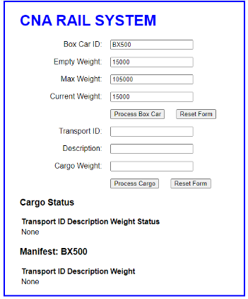
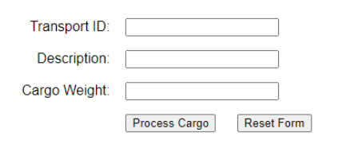
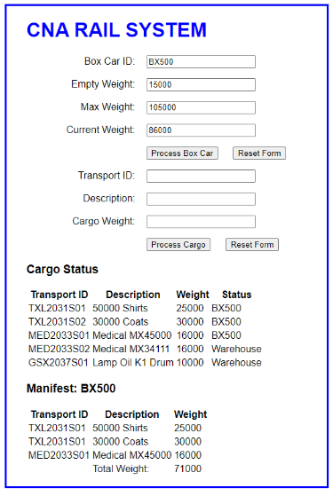

= CP1295 Advanced JavaScript – Assignment 01 – 3%

== Contents

[[a-brief-description]]
[A. Brief Description]

[[b-initial-page]]
[B. Initial Page]

[[c-box-car-form]]
[C. Box Car Form]

[[d-cargo-processing-form]]
[D. Cargo Processing Form]

[[e-process-cargo-javascript]]
[E. Process_Cargo JavaScript]

[[f-submission-reqirements]]
[F. Submission Requirements]

[[g-code-requirements]]
[G. Code Requirements]

[[h-grading-rubric]]
[H. Grading Rubric]

____

== A. Brief Description

Assignment for the course are threaded.
First Assignment begins the thread.
Each subsequent component adds onto the previous assignment.
Since this is a first run for this assignment thread, there is no solution yet established.

I have created the specifications of the first assignment that should provide a solid thread path through all 10 assignments. As the assignments are assigned, it is hopeful that most of the code from the previous assignment will form much of the code for the next assignment. The goal is to spend less time explaining the model and more time working on the solution.

The model for the assignments involves managing cargo for a rail system. In Assignment 01 we will require a single web page form that will contain:
1. data regarding a Box Car that will eventually be attached to a train.
2. data regarding new Cargo Items that will be shipped.
3. Output Display showing all of the cargo that is in the Box Car.

== B. Initial Page

1. Box Car form with three text fields and labels as shown here.
   - Box Car form has non-functional buttons
2. Process Cargo Form with three text fields and labels as shown here.
   - Process Cargo Form’s has two functional buttons

The index.html should only contain code for what is shown in the initial form.

== C. Box Car Form

CNA Rail System has only ONE box car.
These are the details for the box car form of the page.
There are three fields on this form:
- all fields are set to read only
- set initial values for each text field as indicated in the json below

[quote,json]
----
"initial values":[
    {"Box Car ID" : "BX500"},
    {"Empty Weight" : 15000},
    {"Total Weight" : 0}
]
----

The two buttons are non-functional for this assignment.
The empty weight signifies the empty weight of the Box Car.
The total Weight will be updated as the cargo is added to the box car by the cargo_processing JavaScript.

== D. Cargo Processing Form

Cargo processing component of the page has three active fields.

Reset Form will set all three fields to blank.
No Form Data Checking is required for this assignment.

Enter the 5 sets of data as shown in the spreadsheet extract below for processing.

After the entering of each set, click on ‘Process Cargo’.  This will call `process_cargo.js`.

[quote,json]
----
{
"Data Row 1": [
   {"Transport ID": "TXLX2031S01"},
    {"Description": "50,000 Shirts"},
    {"Weight": 25000}
],"Data Row 2": [
   {"Transport ID": "TXLX2031S02"},
    {"Description": "30,000 Coats"},
    {"Weight": 30000}
],"Data Row 3": [
   {"Transport ID": "MED2033s01"},
    {"Description": "Medical MX45000"},
    {"Weight": 16000}
],"Data Row 4": [
   {"Transport ID": "MED2033s02"},
    {"Description": "Medical MX34111"},
    {"Weight": 25000}
],"Data Row 5": [
   {"Transport ID": "GSX2037s01"},
    {"Description": "Lamp Oil K1 Drum"},
    {"Weight": 10000}
]
}
----

== E. Process_Cargo JavaScript

The script will perform the following tasks

2. A Label is created “Car Box Car Manifest for Box Car. XXXXX will be replaced with BX500 by using a DOM selection technique.
3. Table is created with
   1. Header as shown “Transport ID .... “
   2. Each of the data entries will be displayed where indicated by the “XXXXX”  Place holders.
   3. Total Cargo Weight as shown. It is updated as the cargo data is entered.
   4. The ‘Total Weight’ in the Box Car form is updated as the cargo data is entered.

Technique to adding in the table data to the page is unrestricted for this assignment.

== F. Submission Requirements

1. Generate a word document called Assignment 01 – Your name and student number.

=== Page 1

1. Add Course Number
2. Your Name
3. Your Student Number

=== Page 2
Screen Shot of initial FORM prior to any data entry

=== Page 3
Screen Shot of FIRST data entry after ‘Process Cargo’ button pressed.
Expect to observe 1 row of output with correct Total Cargo Weight calculations posted to output and to Box Car form for Total Weight.

[quote,json]
----
{
"Data Row 1": [
   {"Transport ID": "TXLX2031S01"},
    {"Description": "50,000 Shirts"},
    {"Weight": 25000}
]
}
----

=== Page 4
Screen shot of LAST data entry after ‘Process Cargo’ button pressed.
Expect to observe 5 rows of output with correct Total Cargo Weight calculations posted to output and to Box Car form for Total Weight.

[quote,json]
----
{
"Data Row 1": [
   {"Transport ID": "TXLX2031S01"},
    {"Description": "50,000 Shirts"},
    {"Weight": 25000}
],"Data Row 2": [
   {"Transport ID": "TXLX2031S02"},
    {"Description": "30,000 Coats"},
    {"Weight": 30000}
],"Data Row 3": [
   {"Transport ID": "MED2033s01"},
    {"Description": "Medical MX45000"},
    {"Weight": 16000}
],"Data Row 4": [
   {"Transport ID": "MED2033s02"},
    {"Description": "Medical MX34111"},
    {"Weight": 25000}
],"Data Row 5": [
   {"Transport ID": "GSX2037s01"},
    {"Description": "Lamp Oil K1 Drum"},
    {"Weight": 10000}
]
}
----

=== Page 5
Copy and paste the code for your CSS documents. (Not screen shots)

=== Page 6 (or next blank page thereafter)
Copy and paste the code for your index.html (Not screen shots)

=== Page 7 (or next blank page thereafter)
Copy and paste the code for ‘process_cargo.js’

== G. Code Requirements

The assignments are based on
