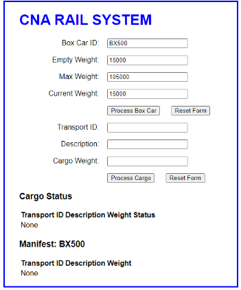
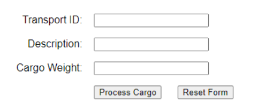

# CP1295 Advanced JavaScript – Assignment 02 – 3%

## Contents

[A. Brief Description](#a-brief-description)

[B. Initial ### Page](#b-initial--page)

[C. Process Cargo Button](#c-process-cargo-button)

[D. Cargo Processing Form](#d-cargo-processing-form)

[E. Processing of the Data](#e-processing-of-the-data)

[F. Submission Reqirements](#f-submission-reqirements)

[G. Code Requirements](#g-code-requirements)

[H. Grading Rubric](#h-grading-rubric)

## A. Brief Description

The specifications for Assignment 2 are based on updates to specifications of Assignment 01.

CNA Rail System is upgrading its software.

For safety reasons it wishes to ensure that the box cars are not overweight.

The track maintenance team require the know the total weight of the boxcar. (Empty Plus Cargo)

Upgrades to the software will include testing to ensure that the BoxCar with cargo will not exceed the
max weight of (BoxCar Empty Weight + Cargo Weight).

The Data Management group wishes to have some basic error checking to include empty fields.

The Cargo Management Team wishes to keep track of the cargo one it has arrived at the cargo depot. The cargo will be placed in the box car if possible. If the addition a any piece of cargo will cause the boxcar to exeed it maximum allowable weight, then the cargo will be placed into the warehouse and will be placed into the next boxcar that is available.

## B. Initial ### Page



Initial ### Page will contain only two forms.

1. BoxCar form with four text fields and labels as shown here and 2 non functional buttons.  
    1. BoxCar ID: Fixed Text BX500  **readonly**
    2. Empty Weight: Fixed Text 15000 **readonly**
    3. Max Weight: Fixed Text 105,000 **readonly**
    4. Total Weight: To Be Set to Empty Weight value when DOM is loaded and  field is readonly.

2. Process Cargo Form with three text fields and labels as shown here. Process Cargo Form has two functional buttons.

    1. All three fields will accept user input. No On-Form editing.  

    2. Process Cargo will only function on two conditions.

        1. If all three fields contain data. Generate an alert message if a Blank Field is detected.

        2. The value contained in ‘Cargo Weight’ is numeric and is between (inclusive) 1 to (Max Weight – Empty Weight). No cargo item can be accepted if it is too heavy for an empty boxcar. Generate an alert message if the weight item is “Non Numeric” or “Exceeds Weight Limit”. You have a total of three possible alert messages.

3. Reset Button will blank only the three fields of Process Cargo Form.

The index.html should only contain code for what is shown in the initial form shown here.

MORE on Process Cargo Button activity to follow .....

## C. Process Cargo Button

The button event handler will perform the necessary tests to see if there will be any cargo processing.

The processing will be as follows.

1. All accepted cargo will be added to Cargo Status.  Accepted is defined as all fields are filled and the weight is within the boundaries specified during the cargo data test.

    ```json
    "Cargo Status": [
        {"Transport ID":"TXL2031S01", "Description":"50000 Shirts","weight":25000,"Status":"BX500"},
        {"Transport ID":"TXL2031S02", "Description":"30000 Coats","weight":30000,"Status":"BX500"},
        {"Transport ID":"MED2033S01", "Description":"Medical MX45000","weight":16000,"Status":"BX500"},
        {"Transport ID":"MED2033S02", "Description":"Medical MX34111","weight":16000,"Status":"Warehouse"},
        {"Transport ID":"GSX2037S01", "Description":"Lamp Oil K1 Drum","weight":10000,"Status":"Warehouse"}
    ]
    ```

    1. A test will be made to ensure that the addition of the cargo to the box car manifest will not put the boxcar overweight.

    2. If the addition of the cargo will not put the box car manifest overweight then the cargo status is set to the ID of the BOXCAR and the cargo is also added to the boxcar manifest.

The box manifest will contain all cargo that has been accepted.

Total Weight is calculated.

The Total Weight (of the Cargo) plus the empty weight of the BoxCar cannot exceed the Max Weight of the BoxCar. The Max Weight of the train is used to ensure that the path that the train will take will support the Total Weight of the train.

## D. Cargo Processing Form

Cargo processing component of the ### Page has three active fields.



The fields are filled out then ‘Process Cargo’ is clicked to activate the processing of the data by calling a javaScript ‘process_cargo.js’.

Reset Form will set all three fields to blank.

Form Checking is not performed within the HTML section. The JavaScript will perform some validation as described in previous sections of this assignment.

Enter the 5 sets of data as shown in the spreadsheet extract below for processing.  

After the entering of each set, click on ‘Process Cargo’.  This will call ‘process_cargo.js’.

```json
"Cargo Status": [
    {"Transport ID":"TXL2031S01", "Description":"50000 Shirts","weight":25000},
    {"Transport ID":"TXL2031S02", "Description":"30000 Coats","weight":30000},
    {"Transport ID":"MED2033S01", "Description":"Medical MX45000","weight":16000},
    {"Transport ID":"MED2033S02", "Description":"Medical MX34111","weight":16000},
    {"Transport ID":"GSX2037S01", "Description":"Lamp Oil K1 Drum","weight":10000}
]
```

## E. Processing of the Data


1. Cargo Status

    1. Create output Labels for Cargo Status with table headers as shown.

    2. Cargo that is NOT accepted for the boxcar will be placed in the warehouse to await the next train.

    3. Cargo fields are added as they are accepted

2. Create output Labels for Manifest.

    1. Header as shown “Manifext: BX500” will determine the correct boxcar ID from the boxcar form.

    2. Table headers are applied as shown in the sample output

    3. All cargo data is displayed as it is added from the cargo form.

    4. The ‘Total Weight’ in the Box Car form is updated as the cargo data is entered.

Technique to adding in the table data to the ### Page is unrestricted for this assignment.

## F. Submission Reqirements

1. Generate a word document called Assignment 02 – Your name and student number.

### Page 1

1. Add Course Number  

2. Your Name

3. Your Student Number

### Page 2

Screen Shot of initial FORM prior to any data entry

### Page 3

Screen Shot of FIRST data entry after ‘Process Cargo’ button pressed.

Expect to observe 1 row of output with correct Total Cargo Weight calculations posted to output and to Box Car form for Total Weight.

### Page 4

Screen shot of LAST data entry after ‘Process Cargo’ button pressed.

Expect to observe 5 rows of output with correct Total Cargo Weight calculations posted to output and to Box Car form for Total Weight.

### Page 5

Screen shot showing a Blank Field situation with the alert message.

### Page 6

Screen shot shown Non Numeric situation for cargo weight field with alert message.

### Page 7

Screen shot showing attempt to enter Cargo with 99,000 kg including the alert message.

### Page 8

Copy and paste the code for your CSS documents. (Not screen shots) 

### Page 9 (or next blank ### Page thereafter)

Copy and paste the code for your index.html (Not screen shots)

### Page 10 (or next blank ### Page thereafter)

Copy and paste the code for ‘process_cargo.js’

## G. Code Requirements

The assignments are based course outline requirements.

Code used for the completioin of this assignment must follow the following guidelines.

Inclusions

1. Code must be based on code demonstrated in this course or its pre-requisite course(s)
    - Course Text Book

    - Course Notes

    - Course Handouts

Exclusions

2. Code must follow the following exclusion rule(s)  

    1. Note: `getElementByID`, `getElementByTag`, `innerHTML`, `outerHTML` are not permitted in this course.  

    2. Where DOM element selection is required use only  

        - `document.querySelector(sel)`  

        - `document.querySelectorAll(sel)` OR  

        - jQuery selector.


## H. Grading Rubric

To maximize your grade be sure to consider the Grading Rubric as part of the of list of requirements.

Items missed are marks that you will not receive.

| Item  | Requirement| value |
|--------|---|----|
|A       | Name, Student #, Assignment # on ### Page 1 |2|
||||
|B1      | HTML file contained Box Car Form new Field Max Weight| 2|
|B2      | HTML file contained Process Cargo Form |2|
|        |**BOX CAR FORM (BCM)** ||
|C1      |Box Car ID / Text Field RO default set BX500 |2 |
|C2      |Empty Weight set to  15000 RO| 4|
|       |Max Weight set to 15000 RO| |
C3 |Current Weight NOT set. |4|
||Value will be set of DOM event listener ||
|C4| Process Box Car Non-Functional Button  |1 |
|C5 |Reset Form Non-Functional Button |1   |
||||
||**Cargo Processing Form (CPF)**||  
|D1| Transport ID / Text Field |2 |
|D2| Description / Text Field |2 |
|D3| Cargo Weight / Text Field |2 |
|D4| Process Cargo Button (exists) |2 |
|D5| Reset Form Button (Exists) |2 |
|D6| Process Cargo Button - calls Java Script |5 |
|D7| Reset Form Button - resets forms 3 fields to blank |5 |
||||
 ||**Process Cargo JavaScript** ||
|E1| DOM Test to set Current Weight to Empty Weight |6 |
|E2| Process Cargo BTN Testing for Blank Fields with Alert  |6 |
|E3| Process Cargo BTN Testing for weight limit  |6 |
|E4| Correct addition of Cargo Data to Cargo Status Form |6 |
|E5| Cargo Status set correctly to BX500 or Warehouse |6 |
|E6| Test of Cargo for adding to manifest  |8 |
|E7| Display Tables initialized and created in Script |6 |
|E8| Manifest Total Weight Displayed |6 |
||||
||**Submission**||
|FP2| Initial FORM SS - PRE data entry |1 |
|FP3| First Data Entry SS |1 |
|FP4| Last Data Entry SS |2 |
|FP5| Blank Cargo Field Test SS |1 |
|FP6| NON numeric cargo weight Test - showing alert SS |2 |
|FP7| Cargo Weight of 99,000 Test - showing alert SS |2 |
|FP8| CSS code |1 |
|FP9| Index.html code |1 |
|FP10| process_cargo.js code |1 |
