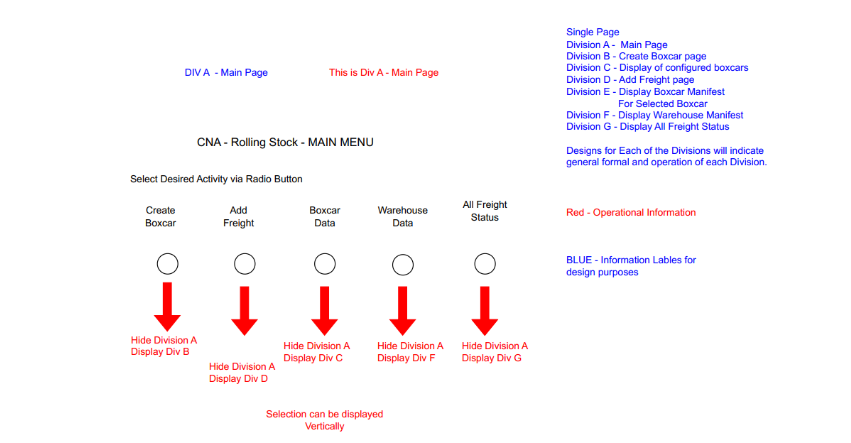
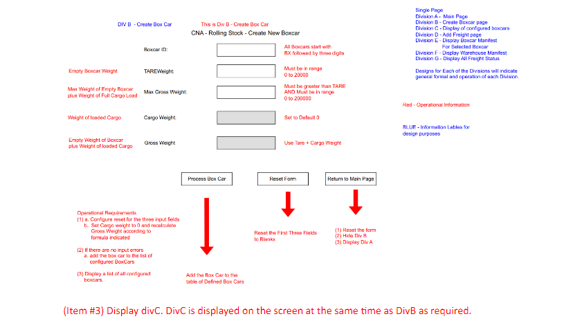
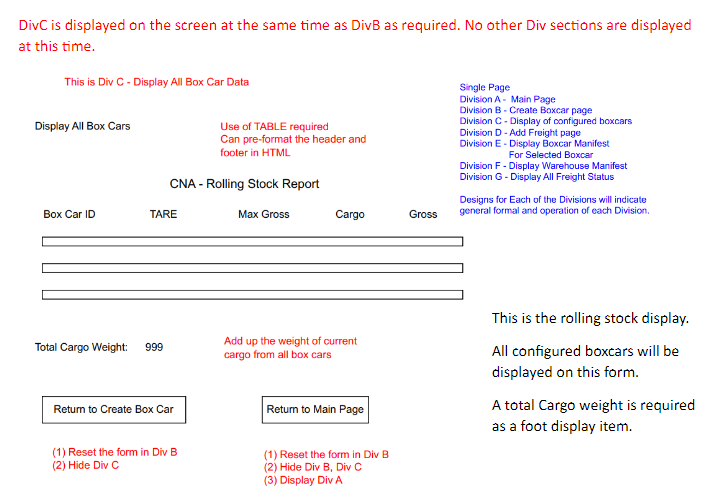
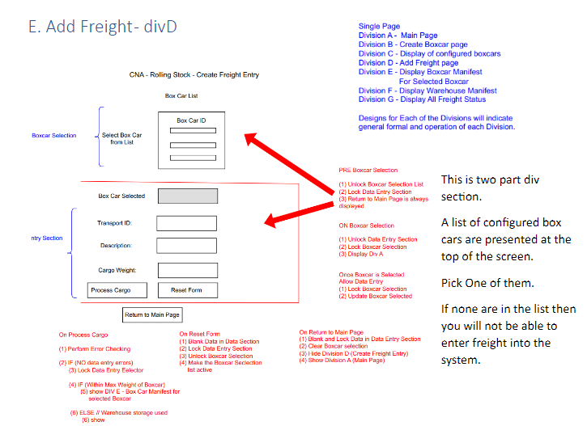
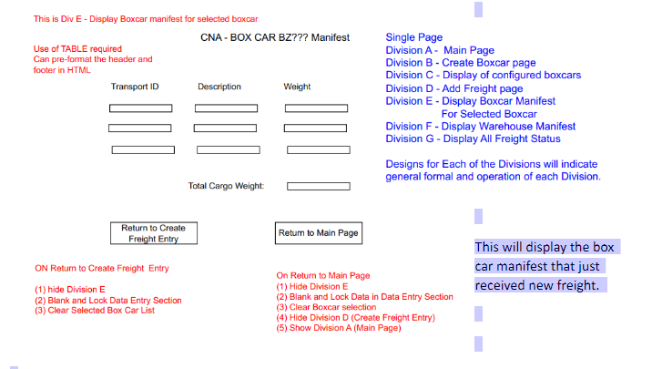
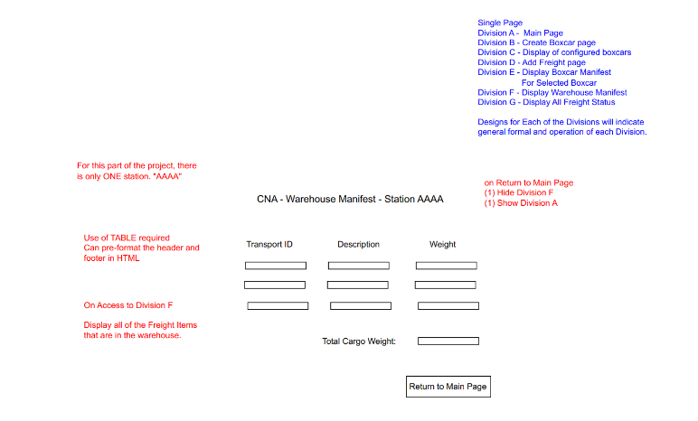
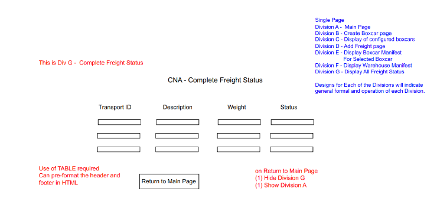
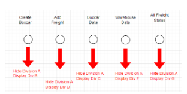

# CP1295 Advanced JavaScript – Project 01 Part A

| Contents                                |
| --------------------------------------- |
| A. Brief Description                    |
| B. Menu = divA                          |
| C. Create Boxcar - divB                 |
| D. Display of Configured Boxcars - divC |
| E. Add Freight - divD                   |
| F. Display Box Car Manifest – divE      |
| G. Display Warehouse Manifest – divF    |
| H. Display All Freight – divG           |
| I. Benchmark Data Test Plan             |
| J. Submission Reqirements               |
| K. Code Requirements                    |
| L. Grading Rubric                       |

## A. Brief Description

The specifications for Project Part A - are based on updates to specifications of Assignment 01 and 02.

CNA Rail System is upgrading its software requirements.
Expansion requirements the ability to **use more than one box car on a train**.
Rules continue from Assignment 01 and Assignment 02.

- This version of the project will consist of one web page.
- DIV sections will be used to simulate a multi page system. - By Hiding and Showing DIV sections, you will be able to use one CSS, one JS and one HTML file. - It is recommended that you consider using arrays of objects to simplify the intermediate data storage
  requirements and its manipulation. - To simplify the Display components of the project, it is permitted to code Table Headers and Footers into
  the applicable DIV sections. - The Body section will still require use of JS.

:warning: **Pre-coding of Body sections of table into HTML will be considered as Out-Of-Scope for this assignment**

## B. Menu = divA

There are 7 DIV sections. Each will be considered to be a pseudo Page.

1.  **ONE** HTML PAGE.
2.  The 7 DIV elements will be used in combinations to simulate various pages as required.
3.  The `blue` text is informational and will not be displayed on the web page.
4.  The `red` text indicate activity requirements of various components.



This is the Main Menu page. It will be contained within

```html
<div id="divA"></div>
```

Using these tags, components can `hide` or `show` based on requirements.

- The Main menu is a Radio Button Page.
- Initially NO buttons are selected.
- Upon return to this page ensure that NO buttons are selected.
  - Ex. If `Add freight` is Selected The main menu `DivA` will be hidded and `DivB` will appear. Before you return back to main menu, be sure to _deselect_ All radio buttons.

## C. Create Boxcar - divB

The project requirements are being displayed as a list of requirements with sample output sketches.

- The project will require the use of more than one boxcar. **There are no default boxcars**. Each will require
  configuration. The sample data testing will use only three box cars, but the next phase may require
  more.

The three initial data entry requirements

1. Box car ID will require a BX followed by three digits. This pattern will be one of the error testing
   requirements. Usage of ‘span’ messaging is encouraged. POP-Ups such a ALERTS are not permitted.
2. Definitions of correct railway terminology is introduced.
   - I.E. TARE weight means Empty boxcar weight.

Read the `Red` and `Blue` information notes to ensure that the definitions are understood.



(Item #3) Display divC. DivC is displayed on the screen at the same time as DivB as required.

Each of the three buttons will have specific task requirements. Three buttons, each will have its own list
of requirements to be met and followed.  
If you discover any inconsistencies, send an e-mail or bring it up in class so that it can be addressed early.

## D. Display of Configured Boxcars - divC

DivC is displayed on the screen at the same time as DivB as required. No other Div sections are displayed
at this time.

This is the rolling stock display.
All configured boxcars will be
displayed on this form.
A total Cargo weight is required
as a foot display item.



Two button choices. Ensure basic display housekeeping. Turn of current <div>s and Turn on Destination

<div>. Reset form requires blanking all input data so when this <div> is required again, it will appear as it 
it was the first time called.  
All of the <div> forms are based on this button logic. 
*** Note: The display shown is not accurately displayed. Each row has 5 columns. There are 5 <td> 
elements in each row.

E. Add Freight - divD



Once you have selected a box car from the list you can enter a Freight entry for the selected box car.
It will require the usual validation process. If the additional weight of the entry will put the boxcar over
its maximum allowable weight, then it will be added to the warehouse manifest otherwise it will be
added to the boxcar manifest. Ensure numeric error tests (> 0) are applied where applicable.
If the freight was added to the box car, then the display will show DivD and DivE. (The box car manifest)
otherwise it will show DivD and DivF(Warehouse manifest).
Each of the possible outcomes are described in the diagram.
\*\*\* Note: If freight cannot be added to Box car due to box car overweight issues and requires that
freight must be placed into warehouse. Display a message in the span (or equivalent) “Cargo Diverted to
Warehouse-weight exceeded” of transport_id.

F. Display Box Car Manifest – divE

This `<divE>` will appear with `<divD>` in the sequence `<divD>` followed by `<divE>`. All `<div>` elements will
appear on the screen in alphabetical order when two or more appear together.


This will display the box
car manifest that just
received new freight.

You can verify that your new freight item is now appearing on the manifest of this boxcar.

There are two possible button options on how to proceed.
(1) Return to Create Freight Entery and continue to add more freight (to any boxcar).
(1) Return to Main Page.
Each option will require some DIV housekeeping such as resetting form values to blank, and closing the
appropriate <DIV> elements and may requiring opening another one.

G. Display Warehouse Manifest – divF

This <divF> will appear with <divD> in the sequence <divD> followed by <divF>. All <div> elements will
appear on the screen in alphabetical order when two or more appear together.



This is similar to the boxcar manifest. All of these Freight items were placed in the warehouse and
therfore have become part of the warehouse manifest.

There is only one button (Return to Main Page).
\*\*\* UPDATE:
Add a Second Button to return to <divD> “Add Freight” to allow option to add more freight.  
In doing this be sure to (1) close this Div “D” section and (2) clear out data section in Div D and (3) clear
selected boxcar item.

H. Display All Freight – divG

This is the simplest of the forms.
This is called only from <divA> Main menu directly.



All freight items are displayed. (In Boxcars and Warehouse).
The Status indicates the Boxcar ID or Warehouse depending on where the Freight item was placed.
The return to Main Page button will simply hide divG and show divA.

This concluded all of the possible Div combinations.

. Benchmark Data Test Plan

The Test Plan involves two phases. First Phase – Box Car Addition. Second Phase – Freight Addition.

1. Create 3 Box Cars

a. With Error data (Code BX1 - Page 3 Screen shot showing error display)
|BX1 |Create Boxcar BA500| 15,000 |105,000 | Fail Data Err Check |
|---|---|---|---|---|

b. With Error data (Code BX2 - Page 4 Screen shot showing error display)
BX2| Create Boxcar BX5000| 12,000 | 90,000 | Fail Data Err Check |
|---|---|---|---|---|

c. With Valid Data  
BX3 Create Boxcar BX500 15,000 105,000 Add to Boxcar List

d. With Valid Data
BX4 Create Boxcar BX505 12,000 90,000 Add to Boxcar List

e. With Valid Data. (Last Box Car to be added). Code is BX5. Page 5 Screen shot required showing the Entry Data and the Display of all Boxcars Created.
BX5 Create Boxcar BX520 10,000 80,000 Add to Boxcar List

BOXCAR Display after BX520 added
|Boxcar ID |Tare |Max Gross| Cargo |Gross |
|---|---|---|---|---|
BX500 | 15,000 | 105,000 | 0 |15,000 |
BX505 12,000 90,000 0 12,000  
BX520 10,000 80,000 0 10,000

Addition of Freight. FTR – Freight Transaction  
CP1295 Advanced JavaScript – Project 01 Part A – 10%
12

Create the following Freight transactions. Take screenshots where indicated.
There are 9 required Freight Transactions labeled in sequence FTR 1 to FTR 9
Data for each Freight Transaction is in the following sequence.
(6) is the Expected Result of the Add Freight Attempt.
(1) FTR (2) Boxcar ID (3) Transport ID (4) Description (5) Weight (6)Result

f. First attempt is to add 50000 Shirts to Boxcar BX500. Weight is 25000. The attempt should be
successful. Code FTR1 – Screen shot page 6. Screenshot should show the data being added and the
corresponding Box Car manifest.
FTR 1 BX500 TXL2031S01 50000 Shirts 25000 Added to BX500

g. FTR 2 attempt is to add a Large Medical Device weighing 16000kg to Boxcar BX505. The attempt
should be successful.
FTR 2 BX505 MED2033S01 Medical MX45000 16000 Added to BX505

h. FTR 3 data test requirement is to Add Freight ID item CSX2037S01 which is Drum of K1 Lamp Oil to
Boxcar BX520. The attempt should be successful.
FTR 3 BX520 CSX2037S01 Lamp Oil K1 Drum 10000 Added to BX520

i. FTR 4 data test requirements. You should be able to decode the test requirements based on the
previous explanations.
FTR 4 BX500 TXL2031S02 30000 Coats 30000 Added to BX500

j. FTR 5 data test requirements.
FTR 5 BX505 MED2033S02 Medical MX34111 16000 Added to BX500

k. FTR 6 data test requirements.
FTR 6 BX520 CSZ2039S02 Fuel Dsl G1 10000L BL 8320 Added to BX520

CP1295 Advanced JavaScript – Project 01 Part A – 10%
13

l. FTR 7 data test requirements. A screen shot (Page 7) is required for this data entry test. Code is FTR 7.
Screen shot should include the data being added as well as the Boxcar manifest.
FTR 7 BX520 CSZ2041S03 Fuel Dsl G2 9000L BL 7928 Added to BX520

m. FTR 8 data test requirements. This data entry test should create a weight exceeded message for
Boxcar BX520. The test involves an attempt to create Freight Item #TXL2031S03 weighing 40000kg and
place this freight item on Boxcar BX500. This would create an overweight problem for the Boxcar,
therefore the item is placed in the warehouse. Screenshot (Page 8) required for FTR 8. The screen should
show the following (1) Data that is being added (2) form messages showing the cargo overweight status
(3) the display of the Warehouse manifest.  
FTR 8 BX500 TXL2031S03 40000 Artic Boots 40000 Added to Warehouse

n. FTR 9 data test requirements. Last Screen shot (Page 9) is required. Screen shot should show (1) the
data that being entered, (2) Any screen information messages such as Boxcar would exceed weight limit,
(3) the warehouse manifest that shows the freight item. This is the last data entry test. There is an
attempt to create Freight ID: MED2033S03 which is large medical device weighing 50000Kg. This device
is to be added to boxcar BX505. This will cause a weight exceeded problem for BX505. The item will be
placed in the Warehouse at this time.
FTR 9 BX505 MED2033S03 Medical MRI4909 50000 Added to Warehouse

o. On the opening page, activate the “All Freight Status” button and generate a display of the status of all
created Freight Items. Take a screen shot. This will be Page 10 content. Code is FTR 10. 9 Freight Items
should be displayed. 2 of these are in Warehouse.



End of data testing.

J. Submission Reqirements

Generate a word document called Assignment 02 – Your name and student number.

Page 1
a. Add Course Number  
b. Your Name
c. Your Student Number

For details on the following re-visit section I – Benchmark Data Test Plan

Page 2 Screen Shot
Screen Shot of running program with DivA showing. Should be the initial screen shot upon starting of the
program.

Page 3 Screen Shot
Creation of Boxcar test. Item a. Code BX1

Page 4 Screen Shot
Creation of Boxcar test. Item b. Code BX2

Page 5 Screen Shot
Creation of Boxcar with valid data. This the last boxcar to be added. Item e. Code BX5

Page 6 Screen Shot
Create of the first Freight Item. Item f Code FR1.

CP1295 Advanced JavaScript – Project 01 Part A – 10%
15

Page 7 Screen Shot
Creation of the last successful Freight Item that will be added to a Boxcar. Code FTR 7. Item l.

Page 8 Screen Shot
Creation of the first Freight item that would exceed max weight situation. Code FTR 8, Item m.

Page 9 Screen Shot
Creation of the second Freight item that would exceed max weight situation for a boxcar. Code FTR 9,
Item n.

Page 10 Screen Shot
All Freight Status Screen Shot. Code FTR 10. This is the last screen shot that is taken after all test data has
been entered.

This concludes the Screen shot collection requirements.

K. Code Requirements

The assignments are based course outline requirements.
Code used for the completioin of this assignment must follow the following guidelines.
Inclusions (note: exclusion rules will overide inclusion rules)
(1) Code must be based on code demonstrated in this course or its pre-requisite course(s)
Use of jQuery is inScope for this project and subect to the terms of ‘scope of valid code’.
Sources (“scope”) of valid of code is limited to the following:
Course Text Book
Course Notes
Course Handouts  
Exclusions
Exclusion will overide inclusion rules.

a. Note: getElementByTag, innerHTML, outerHTML are not permitted in this project.

CP1295 Advanced JavaScript – Project 01 Part A – 10%
17

L. Grading Rubric
To maximize your grade be sure to consider the Grading Rubric as part of the of list of requirements.
Items missed are marks that you will not receive.

CP1295  
Project 01  
Grading Rubric  
General Allocation of Points

ID Name, Student #, Assignment # on Page 1 5  
A Intro Page with Menu Choices - divA 10  
B Create New Boxcar - divB 10  
C Display All Boxcar data - divC 15  
D Add Freight Form - divD 15  
E Display Box Car Manifest - divE 15  
F Display Warehouse Manifest - divF 15  
G Display All Freight Status - divG 15

100

End of Project
